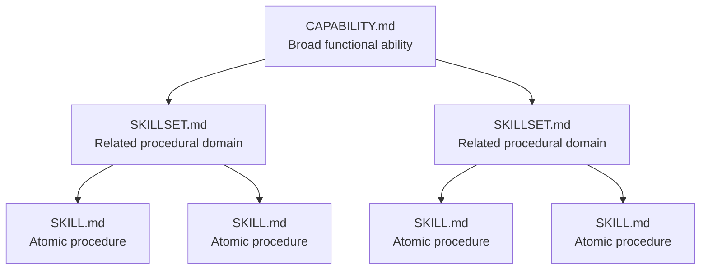
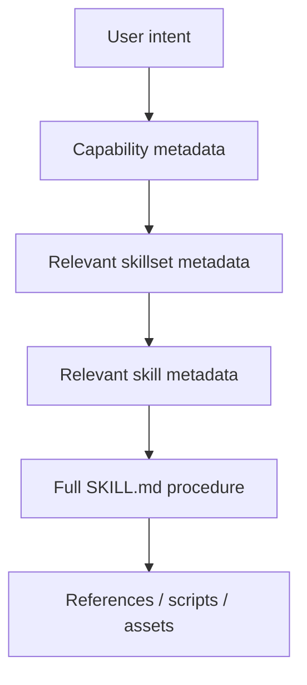
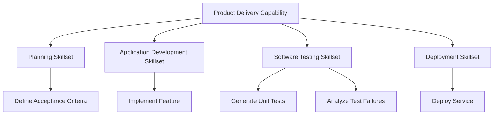
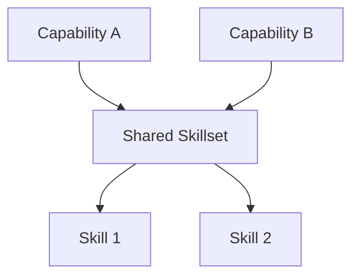

# Capability → Skillset → Skill Composition Model
## A Progressive, Context-Efficient Architecture for Reusable Agent Capabilities

**Status:** Proposed conceptual model  
**Version:** 1.0  
**Date:** September 3, 2026  
**Scope:** Concept and usage model only  
**Normative specifications:**  
- `Specs/capability.specification.md`
- `Specs/skillset.specification.md`
- `Specs/skill.specification.md`

---

## Abstract

Modern agent systems already have a strong atomic unit for reusable procedural behavior: the `SKILL.md` file. A skill can teach an agent how to perform a specific task, include supporting references or scripts, and remain unloaded until the agent determines that the skill is relevant. This progressive-disclosure model is increasingly supported across major agent runtimes and provides an effective way to keep specialized procedural knowledge outside the model's permanent context [1]–[4].

What is still missing from most implementations is a simple, explicit composition model for work that is larger than one skill.

A real engineering capability is rarely reducible to a single procedure. "Software testing," for example, may involve test generation, integration testing, failure analysis, coverage measurement, and regression verification. "Software engineering" is broader still, combining planning, implementation, testing, review, security, and deployment. Loading all of those procedures as one giant skill defeats the context-efficiency that skills were created to provide, while treating every skill as an unrelated flat item leaves the agent without a coherent map of how those skills belong together.

This document proposes a three-level model:

```text
SKILL.md
    one atomic procedure

SKILLSET.md
    a coherent composition of related skills

CAPABILITY.md
    a broader ability composed of one or more skillsets
```

The model follows an **Atomic → Composite → Systemic** progression. Each level describes a larger abstraction while referencing, rather than duplicating, the resources beneath it.

The objective is not to replace the existing Agent Skills specification. `SKILL.md` remains the atomic procedural unit. The proposal adds two higher-order composition layers—`SKILLSET.md` and `CAPABILITY.md`—so agents can discover broad abilities first, progressively resolve only the relevant skillsets, and finally load only the individual skills required for the work being performed.

---

# 1. The Problem This Model Solves

Agent Skills provide an effective answer to the question:

> **How should an agent perform this particular reusable task?**

That does not fully answer:

> **Which related skills belong together?**

or:

> **Which groups of skills collectively constitute a broader ability?**

Without an explicit composition layer, agent repositories tend to develop one of two problems.

### Flat skill catalogs

Every skill exists independently:

```text
skills/
├── generate-unit-tests/
├── run-integration-tests/
├── analyze-test-failures/
├── review-pull-request/
├── inspect-dependencies/
├── generate-release-notes/
├── deploy-service/
└── ...
```

The skills may be individually good, but the agent has no durable semantic structure explaining that some belong to software testing, some belong to code review, and some participate in release engineering.

### Oversized skills

The opposite response is to create one very large skill:

```text
full-software-engineering/
└── SKILL.md
```

and place planning, coding, testing, security, deployment, review, documentation, and release procedures inside it.

That makes the skill harder to maintain and undermines progressive disclosure because the agent must load instructions for many procedures that may have nothing to do with the immediate task.

The proposed model introduces **composition without duplication**.

---

# 2. The Core Model

The hierarchy is intentionally small.



The three layers answer three different questions:

| Layer | Fundamental question |
|---|---|
| **Skill** | **How do I perform this specific task?** |
| **Skillset** | **Which related skills collectively support this area of work?** |
| **Capability** | **Which skillsets collectively provide this broader ability?** |

The hierarchy is therefore:

```text
Atomic
  SKILL.md
      ↓

Composite
  SKILLSET.md
      ↓

Systemic
  CAPABILITY.md
```

This is a composition hierarchy, not an inheritance hierarchy. A capability does not copy a skillset, and a skillset does not copy a skill. Each higher level **references** lower-level resources and explains their relationship.

---

# 3. Level One — `SKILL.md`

## 3.1 Definition

A **skill** is the smallest reusable procedural unit in the model.

It teaches an agent how to perform one bounded task or repeatable procedure. The existing Agent Skills specification defines a skill directory around an exact `SKILL.md` entry file containing YAML frontmatter and Markdown instructions [1].

Examples include:

```text
generate-unit-tests
analyze-test-failure
create-database-migration
review-pull-request
extract-pdf-text
query-postgresql
```

A skill may still contain several procedural steps. "Atomic" does **not** mean "one command." It means the procedure has one coherent purpose and can be understood, invoked, validated, and maintained independently.

---

## 3.2 What belongs in a skill

At the conceptual level, a skill should explain:

- what the procedure accomplishes;
- when it should be used;
- what inputs or prerequisites are required;
- how to perform the work;
- what tools, scripts, references, or assets may be needed;
- what output or result is expected;
- what common failure modes should be considered; and
- how the agent knows the procedure has completed successfully.

The detailed file contract belongs in:

```text
Specs/skill.specification.md
```

This document does not replace that specification.

---

## 3.3 Existing skill structure

The established Agent Skills structure is typically:

```text
skill-name/
├── SKILL.md
├── scripts/
├── references/
└── assets/
```

Only `SKILL.md` is required by the open specification; supporting directories are optional [1].

Hermes and other implementations add richer metadata and conventions while preserving the core `name` and `description` fields used for discovery [2]. The important architectural behavior is progressive disclosure: a runtime can expose only the skill's identity and description initially and load the full procedure later [1]–[4].

---

## 3.4 When something should remain a skill

Create a standalone skill when the task:

- has one recognizable purpose;
- can be invoked independently;
- has its own procedure or validation criteria;
- is reusable in more than one broader workflow; and
- does not need the entire context of a larger discipline to make sense.

If a procedure can be sensibly reused by several different skillsets, that is a strong sign it belongs at the skill level.

---

# 4. Level Two — `SKILLSET.md`

## 4.1 Definition

A **skillset** is a named composition of related skills that collectively support a coherent domain of work, role, task family, or intermediate objective.

A skillset does **not** repeat the full instructions contained in its member skills.

Instead, it answers:

> **Which skills belong together for this kind of work, why do they belong together, and when should each one become relevant?**

For example:

```text
Software Testing Skillset
├── generate-unit-tests
├── run-integration-tests
├── analyze-test-failures
└── calculate-code-coverage
```

Each child remains its own `SKILL.md`.

The skillset supplies the missing composition layer.

---

## 4.2 A skillset is more than a folder

A directory containing ten skills is not automatically a skillset.

The `SKILLSET.md` gives that collection semantic meaning.

It should identify, at minimum:

- the purpose of the skillset;
- the outcomes or task family it supports;
- the skills that belong to it;
- where those skills can be resolved;
- when particular skills are relevant;
- whether any skill must precede or accompany another;
- any shared assumptions or boundaries; and
- when the skillset itself should be selected.

The exact required metadata and reference syntax belong in:

```text
Specs/skillset.specification.md
```

---

## 4.3 Reference, do not duplicate

The central rule of the skillset layer is:

> **A skillset references skills; it does not reproduce them.**

Conceptually:

```yaml
skills:
  - generate-unit-tests
  - run-integration-tests
  - analyze-test-failures
  - calculate-code-coverage
```

The normative specification may use stable identifiers, paths, URIs, or a combination of these. That resolution format should be defined once in `skillset.specification.md`.

The conceptual requirement is simply that a child skill can live wherever the runtime is capable of resolving it.

For example:

```text
project skill
user-local skill
shared organizational skill
installed skill package
remote registry-backed skill
```

The skillset should point to the resource rather than forcing a copied local duplicate.

---

## 4.4 Skillset membership does not imply execution of every skill

A skillset is a **capability map**, not necessarily a sequential macro.

If a skillset contains:

```text
generate-unit-tests
run-integration-tests
analyze-test-failures
calculate-code-coverage
```

a request to diagnose one failing integration test may require only:

```text
run-integration-tests
        ↓
analyze-test-failures
```

There is no reason to load or execute `generate-unit-tests` merely because it belongs to the same skillset.

This distinction is critical for context efficiency.

A `SKILLSET.md` should help the agent identify the **minimal relevant subset** of its member skills.

---

## 4.5 Skillsets may describe relationships

Some skills are independent. Others have meaningful relationships.

A skillset may therefore explain relationships such as:

```text
required
optional
conditional
alternative
precedes
follows
fallback
```

For example:


The purpose is not to turn every skillset into a rigid workflow engine. It is to give the agent enough structure to understand meaningful dependencies when they exist.

If no dependency exists, the skillset should not invent one.

---

## 4.6 Prior art

`SKILLSET.md` is not an entirely unused filename.

Skilldex introduced a skillset abstraction for named bundles of related agent skills and shared supporting context [5]. Better-Claw independently uses `SKILLSET.md` as an intermediate node in a navigable skill tree, with `SKILL.md` as the leaf-level procedure [6].

Those implementations demonstrate that the need for skill composition already exists.

The model proposed here adopts the term **skillset** because it is intuitive and already appearing in the agent ecosystem, but defines it specifically as a **composition and discovery layer** between atomic skills and broader capabilities.

The proposed higher-level `CAPABILITY.md` layer remains distinct from those existing skillset implementations.

---

# 5. Level Three — `CAPABILITY.md`

## 5.1 Definition

A **capability** is a broader functional ability composed of one or more skillsets.

A capability answers:

> **What substantial class of work can this agent system perform, and which skillsets provide that ability?**

Examples might include:

```text
Software Engineering
Research and Analysis
Product Delivery
Security Engineering
Data Engineering
Content Production
```

A capability is intentionally broader than a skillset.

For example:

```text
Software Engineering Capability
│
├── Planning Skillset
├── Application Development Skillset
├── Software Testing Skillset
├── Code Review Skillset
├── Security Review Skillset
└── Deployment Skillset
```

The capability gives the agent a top-level functional map without forcing every individual skill into context.

---

## 5.2 What belongs in a capability

At the conceptual level, `CAPABILITY.md` should define:

- what broad ability the capability represents;
- which outcomes are within its scope;
- which outcomes are outside its scope;
- which skillsets participate;
- how those skillsets relate at a high level;
- when the capability should be considered relevant;
- any major prerequisites, boundaries, or dependencies; and
- how the agent should progressively resolve the lower-level resources it needs.

The exact file contract belongs in:

```text
Specs/capability.specification.md
```

---

## 5.3 A capability is not a workflow

A capability describes **what the system is able to do**.

A workflow describes **how a particular process proceeds**.

Those are related but different concepts.

For example:

```text
CAPABILITY
Software Engineering

SKILLSETS
Planning
Development
Testing
Deployment

WORKFLOW
Plan → Implement → Test → Review → Deploy
```

The capability may reference a workflow when a repeatable execution sequence is appropriate, but it should not become a workflow merely because its skillsets are related.

This distinction prevents capabilities from becoming overly prescriptive.

---

## 5.4 A capability is not an agent

An agent is an execution identity or reasoning actor.

A capability is a declaration of functional ability.

One agent may possess many capabilities:

```text
Engineering Agent
├── Software Engineering Capability
├── Technical Research Capability
└── Documentation Capability
```

And the same capability may be used by more than one agent.

Keeping capabilities separate from agent identities makes both resources more reusable.

---

# 6. Why Three Levels?

The model deliberately stops at three levels because each level has a clear semantic purpose.

```text
SKILL
Specific procedure

SKILLSET
Related procedural domain

CAPABILITY
Broader functional ability
```

Adding arbitrary intermediate layers would reduce predictability.

The hierarchy is useful because it mirrors how humans describe expertise.

Consider an engineer:

```text
Capability:
    Software Engineering

Skillsets:
    Programming
    Testing
    Architecture
    Deployment

Skills inside Programming:
    Implement REST endpoint
    Refactor module
    Debug runtime exception
    Write database query
```

The engineer is not described by one enormous undifferentiated "engineering skill." Nor is expertise represented as hundreds of unrelated atomic techniques.

The intermediate organization matters.

---

# 7. Progressive Disclosure Across the Hierarchy

The primary technical reason for the hierarchy is **context-efficient discovery**.

Agent Skills already use progressive disclosure: lightweight skill metadata can be available before the complete `SKILL.md` is loaded [1], [3], [4].

The same principle can be extended upward.



A runtime does not need to load the entire tree.

Instead:

### Stage 1 — Discover the capability

The system sees enough metadata to know:

> "Software Engineering exists and covers planning, implementation, testing, review, and deployment."

### Stage 2 — Resolve the relevant skillset

If the task is:

> "Figure out why the integration tests are failing."

the system resolves:

```text
Software Engineering
        ↓
Software Testing
```

It does **not** need Deployment or UI Development.

### Stage 3 — Resolve the relevant skills

Inside Software Testing, the immediate task may require:

```text
run-integration-tests
analyze-test-failures
```

### Stage 4 — Load the procedural detail

Only then does the runtime load the corresponding `SKILL.md` instructions and any references those skills actually require.

The result is a navigable procedural architecture rather than a giant prompt.

---

# 8. One Complete Example

Consider a capability for application delivery.

```text
capabilities/
└── product-delivery/
    └── CAPABILITY.md

skillsets/
├── planning/
│   └── SKILLSET.md
├── application-development/
│   └── SKILLSET.md
├── software-testing/
│   └── SKILLSET.md
└── deployment/
    └── SKILLSET.md

skills/
├── define-acceptance-criteria/
│   └── SKILL.md
├── implement-feature/
│   └── SKILL.md
├── generate-unit-tests/
│   └── SKILL.md
├── analyze-test-failures/
│   └── SKILL.md
└── deploy-service/
    └── SKILL.md
```

The relationship is:



Now consider three requests.

### Request A

> "Generate unit tests for this service."

Resolution:

```text
Product Delivery Capability
        ↓
Software Testing Skillset
        ↓
Generate Unit Tests Skill
```

Only the necessary branch needs detailed loading.

### Request B

> "Build and ship this feature."

Resolution may require several skillsets:

```text
Product Delivery Capability
        ↓
Planning
Development
Testing
Deployment
```

Each skillset can then resolve the specific skills required at that stage.

### Request C

> "Analyze this failing integration test."

The system may already know the relevant skillset and directly resolve:

```text
Software Testing Skillset
        ↓
Analyze Test Failures Skill
```

The hierarchy is a discovery aid, not a requirement that every request begin at the root.

---

# 9. Proposed Runtime Layout

A clean repository layout is:

```text
.agents/
├── capabilities/
│   └── software-engineering/
│       └── CAPABILITY.md
│
├── skillsets/
│   ├── application-development/
│   │   └── SKILLSET.md
│   │
│   └── software-testing/
│       └── SKILLSET.md
│
└── skills/
    ├── generate-unit-tests/
    │   └── SKILL.md
    │
    ├── analyze-test-failures/
    │   └── SKILL.md
    │
    └── review-pull-request/
        └── SKILL.md
```

The `.agents/` root is proposed because `.agents/skills/` is already emerging as a cross-tool Agent Skills location in several runtimes [3], [4]. The precise canonical locations for capabilities and skillsets should be settled by their normative specifications.

Alternative host systems may expose other roots:

```text
skills/
skillsets/
capabilities/
```

or vendor-specific directories.

The semantic model should not depend unnecessarily on one filesystem root.

---

# 10. Reference Semantics

The composition model depends on references.

A parent should be able to identify a child resource without embedding that child's instructions.

Conceptually:

```text
CAPABILITY.md
    references SKILLSET.md resources

SKILLSET.md
    references SKILL.md resources
```

A reference system should eventually support enough identity to distinguish:

- the resource name or identifier;
- where the resource can be resolved;
- optional version expectations;
- optional role or membership semantics; and
- whether the child is required, conditional, optional, or an alternative.

The exact schema belongs in the normative specifications.

The important conceptual rule is:

> **References should be resolvable and verifiable, but the model should not require authors to copy child content into the parent.**

---

# 11. Selection Should Be Minimal, Not Exhaustive

A key behavior of this model is **minimal sufficient selection**.

If a capability contains six skillsets, the agent should not load all six merely because the capability was selected.

If a skillset contains twelve skills, the agent should not load all twelve merely because the skillset was selected.

The intended behavior is:

```text
Determine the outcome
        ↓
Resolve the relevant abstraction
        ↓
Select the smallest useful subset
        ↓
Load only what is needed
```

This is the reason for the hierarchy.

It keeps the organizational map visible while avoiding unnecessary procedural context.

---

# 12. Reuse Across Skillsets and Capabilities

The hierarchy should permit reuse.

A skill can belong to more than one skillset.

For example:

```text
review-pull-request
```

might participate in:

```text
Code Quality Skillset
Security Review Skillset
Release Readiness Skillset
```

Likewise, a skillset can participate in more than one capability.

```text
Research Skillset
```

could be used by:

```text
Technical Research Capability
Product Strategy Capability
Security Intelligence Capability
```

This is why the system is best thought of as a **directed composition graph**, even though its primary authoring model looks hierarchical.



Reuse is preferred over duplication.

---

# 13. The Atomic → Composite → Systemic Pattern

The skill model illustrates a more general organizational principle:

```text
ATOMIC
    one independently meaningful unit

COMPOSITE
    related atomic units assembled into a coherent group

SYSTEMIC
    multiple composites coordinated into a broader functioning ability
```

For execution knowledge:

```text
Atomic      → SKILL.md
Composite   → SKILLSET.md
Systemic    → CAPABILITY.md
```

This document defines that progression only for procedural capabilities.

The same granularization principle may eventually be applied to other agent subsystems, but those extensions should receive their own definitions rather than being silently folded into this specification.

---

# 14. What This Model Is Not

## 14.1 It is not a replacement for Agent Skills

`SKILL.md` remains the atomic resource and should remain compatible with the open Agent Skills specification wherever possible.

## 14.2 It is not a requirement to nest files physically

A skillset references skills. Those skills do not necessarily need to be physically nested beneath the skillset directory.

Likewise, capability membership does not require copying the skillset into the capability folder.

## 14.3 It is not a rigid workflow engine

Relationships may be described when useful, but a skillset is not automatically an ordered workflow.

## 14.4 It is not an agent hierarchy

Skills and capabilities describe what can be done. Agents describe who or what performs the work.

## 14.5 It is not an excuse to create unnecessary layers

If one skill is sufficient, use one skill.

If a set of related skills is sufficient, use a skillset.

Create a capability only when multiple skillsets genuinely form a broader ability.

---

# 15. Authoring Decision Guide

A developer should be able to choose the correct level with three questions.

### Question 1

**Am I defining how to perform one reusable task?**

If yes:

```text
SKILL.md
```

### Question 2

**Am I grouping several related skills that collectively support one coherent area of work?**

If yes:

```text
SKILLSET.md
```

### Question 3

**Am I defining a broader functional ability that requires multiple skillsets?**

If yes:

```text
CAPABILITY.md
```

At a glance:

| Situation | Use |
|---|---|
| "How do I generate unit tests?" | `SKILL.md` |
| "What procedures make up software testing?" | `SKILLSET.md` |
| "What skill domains make up software engineering?" | `CAPABILITY.md` |

---

# 16. Anti-Patterns

## Giant skill

```text
full-stack-engineer/SKILL.md
```

containing hundreds or thousands of lines for every possible software-engineering activity.

**Problem:** destroys modularity and progressive disclosure.

**Better:** split atomic procedures into skills, organize them into skillsets, and expose the broader ability as a capability.

---

## Empty skillset

```text
SKILLSET.md
```

that merely lists filenames without explaining what the collection represents or when its members matter.

**Problem:** acts only as a directory listing.

**Better:** define the coherent purpose of the collection and enough selection semantics for the agent to understand its members.

---

## Duplicated child instructions

A `SKILLSET.md` copies the procedures from every `SKILL.md`.

**Problem:** creates inconsistent duplicate sources of truth.

**Better:** reference the skills.

---

## Capability as marketing label

```text
CAPABILITY.md
```

says only:

> "This capability makes the agent an advanced world-class engineer."

**Problem:** provides no operational structure.

**Better:** define the functional boundary and the skillsets that make the capability real.

---

## Forced traversal

The runtime always loads:

```text
CAPABILITY → every SKILLSET → every SKILL
```

before doing any work.

**Problem:** defeats the entire architecture.

**Better:** resolve only the branch needed for the current intent.

---

# 17. Relationship to the Normative Specifications

This document defines the **conceptual model**.

The exact construction rules belong in three separate normative specifications maintained under the project's specification system:

```text
Specs/
├── capability.specification.md
├── skillset.specification.md
└── skill.specification.md
```

Their responsibilities should remain distinct.

### `skill.specification.md`

Defines the construction and validation of an atomic `SKILL.md`, including compatibility with the Agent Skills standard.

### `skillset.specification.md`

Defines the construction and validation of `SKILLSET.md`, including member references, selection semantics, dependency representation, and resolution behavior.

### `capability.specification.md`

Defines the construction and validation of `CAPABILITY.md`, including skillset references, capability scope, discovery metadata, and progressive resolution.

This separation keeps the explanatory document readable for humans while allowing the normative specifications to remain precise enough for tooling, validators, and agent authors.

---

# 18. Relationship to Existing Practice

The proposal deliberately builds from existing conventions rather than replacing them.

### Existing foundation

Agent Skills has established:

```text
SKILL.md
YAML metadata
procedural Markdown
optional scripts
optional references
optional assets
progressive disclosure
```

[1]

Claude, Codex, Hermes, and other systems demonstrate that progressively loading procedural instructions is practical in real agent runtimes [2]–[4].

### Existing skillset precedent

Skilldex has already demonstrated a named `SKILLSET.md` abstraction for bundled related skills and shared context [5]. Better-Claw has demonstrated a tree structure in which `SKILLSET.md` acts as an intermediate category/index and `SKILL.md` acts as the leaf procedure [6].

### Proposed extension here

This model formalizes the three semantic levels as:

```text
SKILL
    atomic procedure

SKILLSET
    coherent composition and discovery layer for related skills

CAPABILITY
    broader functional ability composed of skillsets
```

The value of the proposal is therefore not merely the creation of another filename. It is the **explicit semantic relationship between the three resource levels and the progressive-loading behavior that relationship enables**.

---

# 19. Design Principles

The model should remain governed by a small number of principles.

### 1. Keep atomic procedures independently reusable

A skill should not require its parent skillset to be understandable unless the procedure truly cannot exist independently.

### 2. Reference instead of duplicate

Parents identify and organize children; they do not copy child instructions.

### 3. Load progressively

Expose enough metadata to navigate the hierarchy, then load detailed instructions only when needed.

### 4. Select minimally

Membership in a skillset or capability does not imply that every member must be activated.

### 5. Permit reuse

A useful skill or skillset may participate in more than one parent composition.

### 6. Describe relationships only when they are real

Do not invent ordering or dependencies simply to make the structure appear sophisticated.

### 7. Keep capability separate from execution identity

Capabilities describe abilities. Agents describe actors.

### 8. Stop decomposing when decomposition stops adding value

The model exists to make complex capability easier to understand and load—not to maximize the number of files.

---

# 20. Final Definition

The complete model can be stated in one paragraph:

> A **skill** is one reusable procedural capability defined by `SKILL.md`. A **skillset** is a named composition of related skills defined by `SKILLSET.md`; it explains what the collection accomplishes, references its member skills, and helps an agent select the relevant procedures without loading the entire collection. A **capability** is a broader functional ability defined by `CAPABILITY.md`; it references one or more skillsets and describes the larger outcomes those skillsets collectively make possible. Together, the three resources form an **Atomic → Composite → Systemic** hierarchy designed for modular reuse and progressive context loading.

Or, in its shortest form:

```text
SKILL.md
    How to perform one task.

SKILLSET.md
    Which related skills make up an area of work.

CAPABILITY.md
    Which skillsets make up a broader ability.
```

The governing rule is equally simple:

> **Describe broadly at the top, resolve specifically as needed, and load procedural detail only when the work requires it.**

---

# References

[1] Agent Skills, “Specification,” *Agent Skills*. [Online]. Available: https://agentskills.io/specification. Accessed: Sep. 3, 2026.

[2] Nous Research, “Skills System,” *Hermes Agent Documentation*. [Online]. Available: https://hermes-agent.nousresearch.com/docs/user-guide/features/skills/. Accessed: Sep. 3, 2026.

[3] Anthropic, “Equipping agents for the real world with Agent Skills,” *Anthropic Engineering*. [Online]. Available: https://www.anthropic.com/engineering/equipping-agents-for-the-real-world-with-agent-skills. Accessed: Sep. 3, 2026.

[4] OpenAI, “Using skills,” *OpenAI Academy*. [Online]. Available: https://openai.com/academy/skills/. Accessed: Sep. 3, 2026.

[5] S. Saha and P. Hemanth, “Skilldex: A Package Manager and Registry for Agent Skill Packages with Hierarchical Scope-Based Distribution,” *arXiv preprint arXiv:2604.16911*, Apr. 2026. [Online]. Available: https://arxiv.org/abs/2604.16911.

[6] W. Sumbon, “Better-Claw,” *GitHub*. [Online]. Available: https://github.com/WalterSumbon/better-claw. Accessed: Sep. 3, 2026.

---

## Document Scope Note

This document explains the Capability → Skillset → Skill composition model and its rationale. It intentionally avoids becoming the normative file-format specification. Required YAML fields, exact reference schemas, validators, inheritance rules, version resolution, and other machine-enforceable requirements belong in the corresponding files under `Specs/`.
