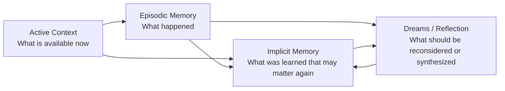
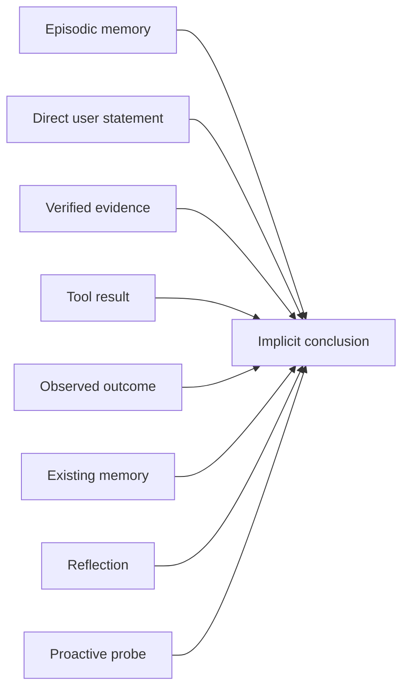
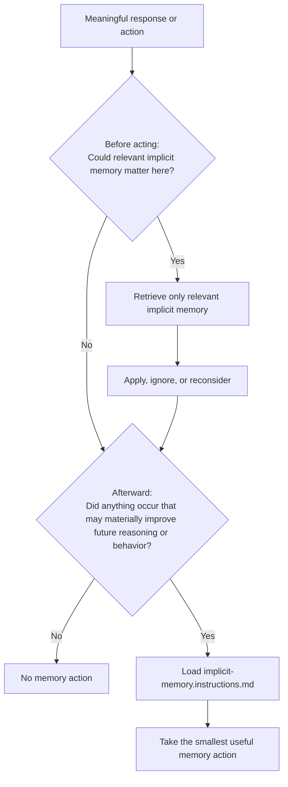

# Implicit Memory
## Dynamic, Evidence-Grounded Memory for Adaptive Agent Behavior

**Status:** Operational subsystem documentation  
**Version:** 1.0  
**Date:** September 3, 2026  
**Entry point:** `memory/implicit/IMPLICIT_MEMORY.md`  
**Mutable store:** `memory/implicit/implicit.memory.md`  
**Operational instructions:** `memory/implicit/implicit-memory.instructions.md`  
**Normative format specification:** `agent-specifications/Specs/implicit-memory.specification.md`

---

## 1. Purpose

Implicit memory exists to let an agent **learn useful, revisable conclusions from experience and apply those conclusions later when they can improve future reasoning or behavior**.

The subsystem is deliberately not a transcript archive and not a mechanism for saving everything the model sees. Its purpose is to preserve only information that is likely to matter after the current context is gone.

A useful implicit memory should answer more than:

> What did I learn?

It should also answer:

> When will this matter again, and what should I do differently because I learned it?

The operating principle is:

> **Learn what matters, retain what helps, apply it when relevant, and revise it when reality changes.**

Implicit memory is therefore **dynamic**. It may be created, refined, narrowed, qualified with exceptions, superseded, or removed. A previously useful conclusion is not treated as permanent merely because it was once stored.

---

## 2. What Implicit Memory Is

For this subsystem, **implicit memory** means:

> **Persistent, revisable knowledge that an agent derives from interaction, observations, evidence, outcomes, prior memories, or reflection because retaining that knowledge is expected to materially improve future reasoning or behavior.**

This definition is intentionally operational. It does not claim that the underlying language model has biological or psychological implicit memory.

Examples of information that may belong in implicit memory include:

- a recurring communication preference that changes how the agent should respond;
- a learned failure pattern that should be avoided in future work;
- a strategy that consistently works in a particular context;
- a derived project constraint that is not obvious from the current code;
- a contextual distinction that prevents the agent from overgeneralizing a user preference;
- an exception to an otherwise useful behavioral default;
- a conclusion derived from several episodes or pieces of evidence;
- an environmental change that invalidates an older working assumption.

Implicit memory is **not** intended to hold:

- every conversational fact;
- temporary details already available in active context;
- raw transcripts;
- trivia with no plausible future consequence;
- unsupported guesses;
- invented numerical confidence values;
- current explicit instructions that belong in the active prompt or instruction system;
- immutable policy, safety, permission, or system-level authority.

---

## 3. The Memory Layers

Implicit memory is one layer in a larger memory architecture.



### Active Context

**Active context** is information presently available to the model in the current conversation or runtime context window.

It may be highly useful now but disappear when the session ends, the context is compacted, or older tokens are removed.

Being present in active context is **not** sufficient reason to persist something.

### Episodic Memory

**Episodic memory** records events, interactions, decisions, corrections, or outcomes.

It answers:

> **What happened?**

Example:

> The user rejected a generated 117-file architecture and asked for a much smaller number of consolidated documents.

That is an event.

### Implicit Memory

**Implicit memory** stores a useful conclusion derived from what happened or from other evidence.

It answers:

> **What have I learned that should influence something later?**

Example:

> During exploratory architecture discussions, avoid prematurely decomposing the work into many artifacts. Prefer consolidated structures until the user explicitly requests implementation.

That is a learned behavioral conclusion.

### Dreams / Reflection

**Dreams or reflection** are slower synthesis processes that reconsider accumulated episodes, outcomes, contradictions, and implicit conclusions.

They answer:

> **What patterns, mistakes, conflicts, or lessons should I reconsider?**

Reflection may propose an implicit-memory update, but reflection is not required before every implicit-memory change.

---

## 4. Evidence Does Not Require an Episode

An episode is one valid source of evidence. It is not a mandatory gateway.



If a trusted tool directly proves that an old conclusion is wrong, the agent may update the relevant implicit memory directly. It does not need to manufacture an episodic record merely to satisfy a processing pipeline.

Conversely, an episode may be worth recording without supporting any implicit conclusion yet.

---

## 5. The Subsystem Is Intentionally Simple

The runtime behavior is based on two lightweight checks.



The subsystem does **not** require a fixed chain such as:

```text
observation → episode → score → reflection → belief → memory
```

The agent is explicitly allowed to use only the reasoning steps necessary for the situation.

Examples:

```text
Explicit correction → UPDATE
Verified evidence → SUPERSEDE
Repeated episodes → REFLECT → ADD
Temporary detail → CONTEXT
Ambiguous one-time event → EPISODE
Nothing useful → NOOP
```

---

## 6. The Central Value Test

Before persisting an implicit conclusion, ask:

> **Would remembering this materially improve something I may need to reason about or do later, after the evidence currently in context is no longer available?**

Useful implicit memory normally provides at least one of these forms of value:

| Value | Meaning |
|---|---|
| **Behavioral value** | Changes how the agent should act, communicate, or respond. |
| **Reasoning value** | Improves interpretation, judgment, planning, or decision-making. |
| **Predictive value** | Helps anticipate likely intent, preference, constraints, or outcomes. |
| **Efficiency value** | Prevents repeated discovery, redundant questions, or unnecessary work. |
| **Continuity value** | Preserves useful understanding across sessions, projects, or long-running work. |
| **Error-prevention value** | Helps prevent a previously discovered mistake, failure, or rejected behavior from recurring. |

If the information has no plausible future value, do not persist it.

---

## 7. What Makes Implicit Memory Change

Implicit memory may change when new information has a meaningful effect on an existing conclusion or reveals a new future-useful conclusion.

Common cues include:

### Direct human cues

- **Correction** — the user explicitly corrects an assumption, behavior, memory, or interpretation.
- **Preference declaration** — the user states a preference likely to matter again.
- **Preference withdrawal** — the user says a former preference no longer applies.
- **Commitment** — the user establishes an ongoing expectation, convention, or working relationship.
- **Goal change** — the intended outcome changes.
- **Priority change** — the balance among speed, quality, cost, detail, risk, or another objective changes.
- **Forget or revoke request** — the user explicitly asks that retained information no longer be used or stored.

### Evidence and outcome cues

- **Verified new evidence** — a trusted source, file, API, tool, or other observation changes what should be believed or done.
- **Contradiction** — current evidence conflicts with an existing conclusion.
- **Meaningful outcome** — an action succeeds, fails, or behaves unexpectedly in a way that teaches something reusable.
- **Successful strategy** — a method repeatedly works in a particular situation.
- **Failure pattern** — a method repeatedly fails, produces poor results, or is rejected.
- **Application feedback** — using an implicit memory produces evidence about whether that memory is correct, incomplete, or harmful.
- **Prediction mismatch** — what the agent expected differs materially from what happened.

### Pattern and context cues

- **Repetition** — similar behavior or evidence recurs enough to suggest a pattern rather than an isolated event.
- **Cross-context recurrence** — the same pattern appears in independent conversations, projects, or tasks.
- **Preference drift** — recent behavior increasingly differs from a previously stable preference.
- **Exception discovery** — an otherwise useful conclusion is found not to apply under a particular condition.
- **Contextual distinction** — a conclusion that looked general is discovered to depend on project, task, person, mode, or situation.
- **Environmental change** — software, people, tools, organizations, policies, resources, or other external conditions change.
- **Constraint change** — time, budget, hardware, permissions, access, or other limitations change.
- **Expiration or staleness** — information was once valid but its useful period has ended.

### Reflective and elicited cues

- **Synthesis** — several pieces of information together reveal a conclusion that no single event established.
- **Reflection** — reviewing earlier actions or memories reveals a better interpretation or strategy.
- **Proactive elicitation** — a deliberately asked question resolves an uncertainty that has meaningful future value.

These cues are recognition aids. They are **not mandatory pipeline stages and are not exhaustive**.

---

## 8. What an Implicit Memory Must Be Able to Do

A useful implicit memory is actionable.

A record should preserve enough information to answer:

1. **Conclusion** — What was learned?
2. **Applies When** — What future situation makes the conclusion relevant?
3. **Action** — What should the agent do differently because of it?
4. **Exceptions** — When should the conclusion not be applied?
5. **Reconsider When** — What future signal should cause the conclusion to be reviewed?
6. **Basis** — Why does the conclusion currently exist?

Example:

```markdown
## Architecture Discussion Behavior

**Kind:** behavioral preference

### Conclusion

During exploratory architecture discussions, the user generally prefers
consolidated designs and minimal artifact fragmentation.

### Applies When

The conversation is exploratory and it is unclear whether the user wants
continued discussion or actual deliverables.

### Action

Remain conversational and do not prematurely generate a large artifact set.
Clarify only when execution intent is genuinely ambiguous.

### Exceptions

If the user explicitly asks for files, documents, code, or another deliverable,
perform the requested work without asking again.

### Reconsider When

Reevaluate if the user explicitly changes the preference or repeatedly behaves
differently in the same context.

### Basis

Derived from repeated direct corrections concerning premature artifact
generation and excessive document fragmentation.
```

---

## 9. Authority and Override Rules

Implicit memory is learned context, not governing authority.

When a conflict exists, use this order:

```text
Current explicit user request
        ↓
Applicable system / policy / permission constraints
        ↓
Verified current evidence
        ↓
Applicable explicit project or agent instructions
        ↓
Relevant implicit memory
```

The host runtime may impose additional higher-authority rules.

An implicit memory must never independently override current explicit instructions, safety constraints, permissions, authoritative policy, immutable system configuration, or an explicit forget or revoke request.

---

## 10. Files in This Package

```text
memory/
├── MEMORY_INDEX.md
│
└── implicit/
    ├── IMPLICIT_MEMORY.md
    ├── implicit-memory.instructions.md
    ├── implicit.memory.md
    │
    └── tools/
        └── implicit-memory-tool.specification.md
```

- `IMPLICIT_MEMORY.md` — this root entry document and conceptual map.
- `implicit-memory.instructions.md` — the complete executable instruction set.
- `implicit.memory.md` — the mutable human-readable memory store.
- `tools/implicit-memory-tool.specification.md` — persistence and retrieval interface contract.
- `agent-specifications/Specs/implicit-memory.specification.md` — external normative file-format specification.

---

## 11. Quick Setup

1. Add an entry to the existing `memory/MEMORY_INDEX.md` pointing to `memory/implicit/IMPLICIT_MEMORY.md`.
2. Add the compact runtime hook from `implicit-memory.instructions.md` to the master agent prompt.
3. Implement `[IMPLICIT_MEMORY_TOOL]` according to `tools/implicit-memory-tool.specification.md`, or configure file-backed mode.
4. Load the detailed instructions only when the lightweight runtime hook determines that memory retrieval or learning may matter.
5. Retrieve narrowly; do not load the full memory store during ordinary turns.
6. Keep one authoritative persistence source so file and database state cannot silently diverge.

A ready-to-insert parent-index entry is included at `memory/MEMORY_INDEX_ENTRY.md`.

---

## 12. Research Lineage

This subsystem keeps a small number of useful ideas from existing memory research. Generative Agents demonstrated experience storage, retrieval, reflection, and higher-level synthesis [1]. Reflexion showed that natural-language feedback from outcomes can improve subsequent behavior without model-weight updates [2]. MemGPT separated limited in-context memory from larger external memory tiers [3]. Mem0 emphasized selective extraction, consolidation, and retrieval rather than replaying complete histories [4]. A-MEM explored memory evolution, where new information can update existing representations [5]. Memory-R1 demonstrated explicit operations such as add, update, delete, and no-op, although its reinforcement-learning implementation is not required here [6].

The present design keeps only the lightweight ideas needed for a prompt-driven runtime:

```text
selective attention
selective persistence
evidence-grounded revision
actionable learned conclusions
dynamic update and removal
context-efficient retrieval
reflection only when useful
```

No numerical confidence score is required. No fixed reflection pipeline is required. No model-weight update is implied.

---

## 13. Scope of the Claim

This subsystem can provide **inference-time adaptive behavior supported by external persistent memory**. It does not by itself make a language model conscious, self-aware, or an Artificial General Intelligence (AGI), and it does not update pretrained model weights.

Its engineering objective is:

> **Allow an agent to carry useful learned understanding forward without turning memory into an append-only history or an inflexible rule system.**

---

# References

[1] J. S. Park, J. C. O'Brien, C. J. Cai, M. R. Morris, P. Liang, and M. S. Bernstein, “Generative Agents: Interactive Simulacra of Human Behavior,” *arXiv preprint arXiv:2304.03442*, 2023.

[2] N. Shinn, F. Cassano, E. Berman, A. Gopinath, K. Narasimhan, and S. Yao, “Reflexion: Language Agents with Verbal Reinforcement Learning,” *arXiv preprint arXiv:2303.11366*, 2023.

[3] C. Packer, S. Wooders, K. Lin, V. Fang, S. G. Patil, I. Stoica, and J. E. Gonzalez, “MemGPT: Towards LLMs as Operating Systems,” *arXiv preprint arXiv:2310.08560*, 2023.

[4] P. Chhikara, D. Khant, S. Aryan, T. Singh, and D. Yadav, “Mem0: Building Production-Ready AI Agents with Scalable Long-Term Memory,” *arXiv preprint arXiv:2504.19413*, 2025.

[5] W. Xu, Z. Liang, K. Mei, H. Gao, J. Tan, and Y. Zhang, “A-MEM: Agentic Memory for LLM Agents,” *arXiv preprint arXiv:2502.12110*, 2025.

[6] S. Yan et al., “Memory-R1: Enhancing Large Language Model Agents to Manage and Utilize Memories via Reinforcement Learning,” *arXiv preprint arXiv:2508.19828*, 2025.
